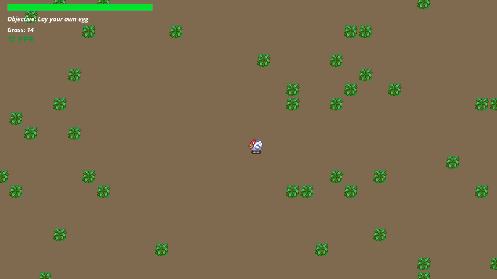

# l00p egg life

An open source 2D game built using Ocaml, Raylib and miou.
You will start out as an egg and will have to grow into a chicken and lay an egg just like the one you were.

https://piterweb.itch.io/l00p-egg-life

## Mentions

Chicken by Diarandor - Creative Commons Attribution-Share Alike (CC BY-SA) version 4.0.

Map assets by [Buch](https://opengameart.org/users/buch) http://blog-buch.rhcloud.com