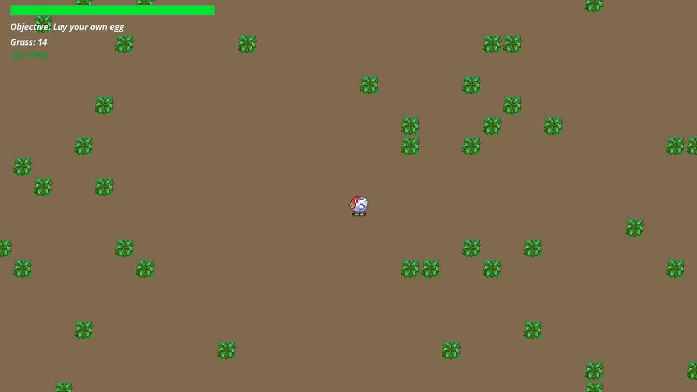

# l00p egg life

An open source 2D game built using Ocaml, Raylib and miou.
You will start out as an egg and will have to grow into a chicken and lay an egg just like the one you were.

https://piterweb.itch.io/l00p-egg-life



## Development

To develop the game you need OCaml with dune

### How to build

Install dependencies:

```bash
opam install dune
opam install raylib
opam install miou
```

```bash
dune build
```

The file will be located at _build/default/bin/main.exe
To execute it you will need the assets folder in the directory

## How to develop

Install dependencies:

```bash
opam install dune
opam install raylib
opam install miou
```

```bash
dune exec game
``` 

This will execute the current code (normally the FPS here are less than the production build)

## Mentions

Chicken by Diarandor - Creative Commons Attribution-Share Alike (CC BY-SA) version 4.0.

Map assets by [Buch](https://opengameart.org/users/buch) http://blog-buch.rhcloud.com
